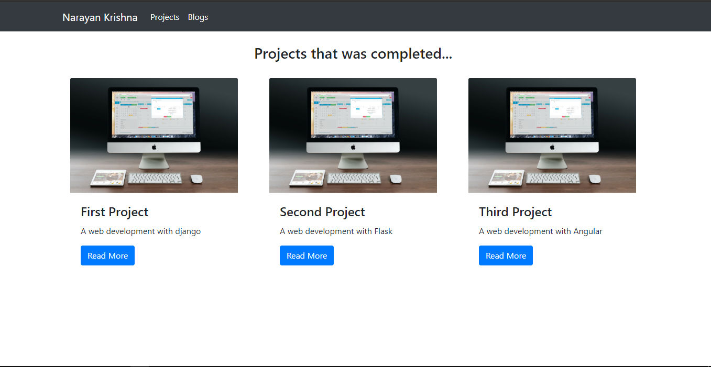
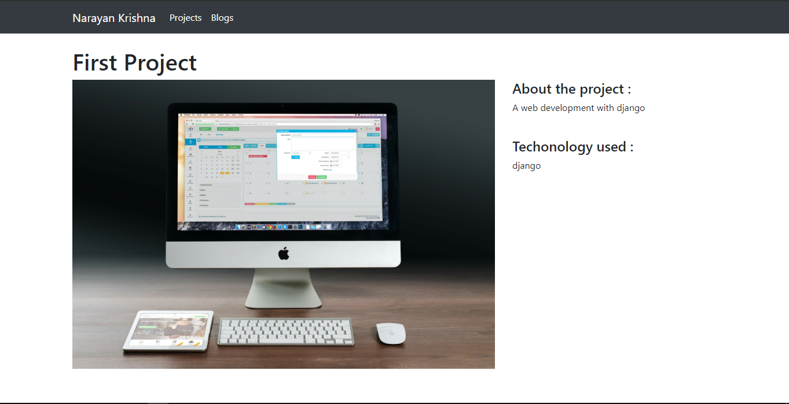
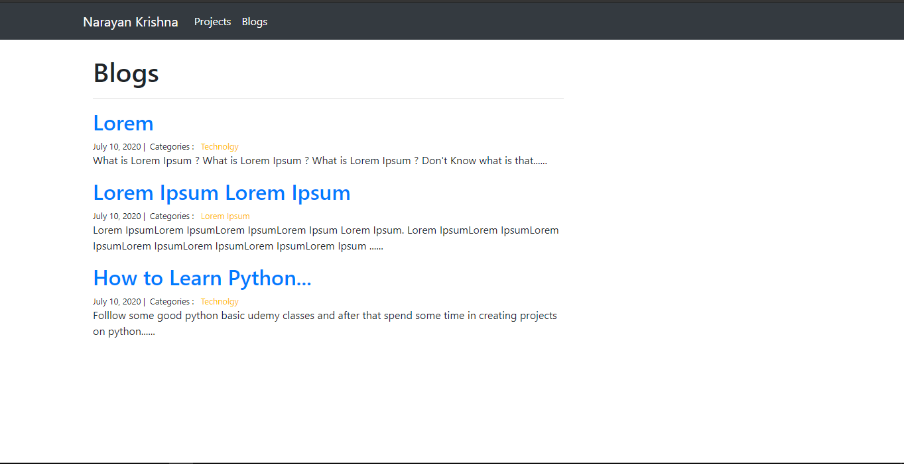
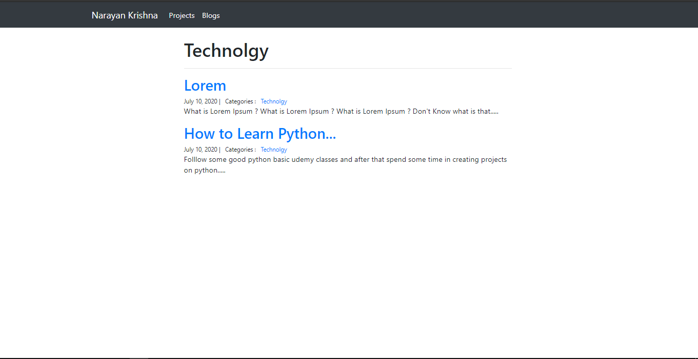
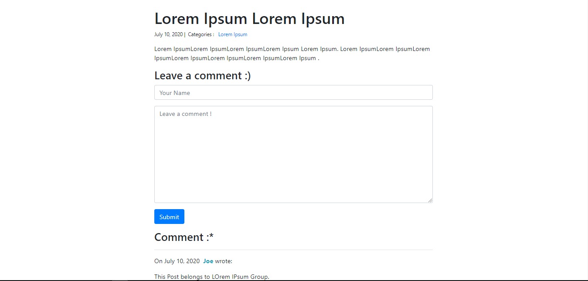

# Django Portfolio Project #

_To revise basics of django._

### This Project contains two web app  :- ### 
1) Portfolio app : _to showcase projects_.
2) Blog app : _to create,update,delete blog entry_.

---
### Screenshots of Project ####

**Project Showcase**
 Project Index 
 Project Detail

**Blog**
  Blog Index
 Blog Categories
 Blog Comment

---

###  This Project includes following topics :- ###
**Brief Intro** 

- virtual env
- Django app
- Django views
- Adding Bootstrap to django

**Project Showcase** 

- Project App : Model
- Project App : Views
- Project App : Templates

**Blog** 

- Blog App : Model
- Blog App : Django-Admin
- Blog App : Views
- Blog App : Templates
  
**Conclusion**

_Django (Framework of python) provides MVT structure to create simple and easy to manage web apps with django admin. Model is used to create class to manage data, Views contains the functions that defines the working of the web apps and Templates are the HTML design built to show the web-app to the user. In this Project we create a website which contain two apps i.e Project-showcase(portfolio) to show the detailed information about the project and Blog that contains detailed information and comment section so that the user have better interaction with the web-app._

>Important topics 
**Django Template Inheritance** 
**Django Model, Views, Templates** 
**Django Static File Handling** 